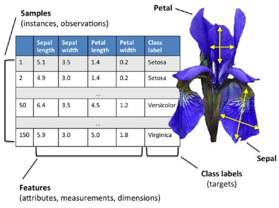
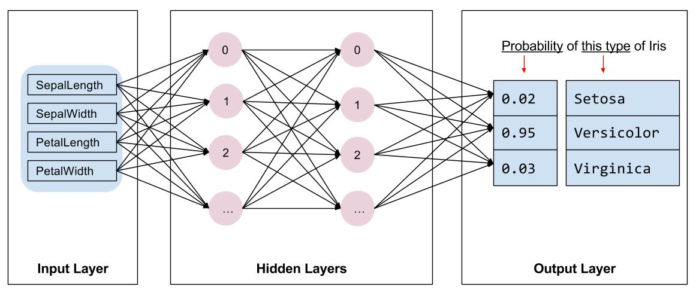
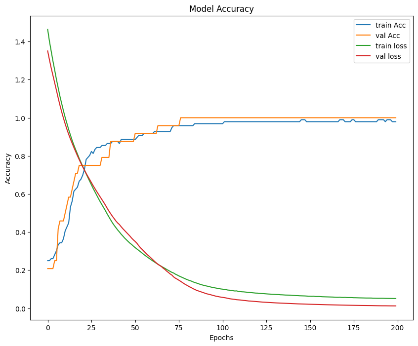
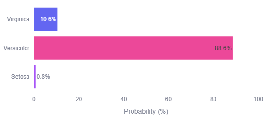
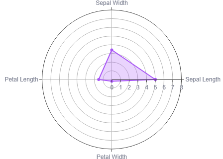

# 🌸 Iris-ANN-Classifier

An interactive web application that classifies Iris flowers into **Setosa**, **Versicolor**, or **Virginica** using an Artificial Neural Network (ANN) built with TensorFlow/Keras, wrapped in an interactive Streamlit interface.

🔗 **Live Demo:** [iris-neural-classifier.streamlit.app](https://iris-neural-classifier.streamlit.app/)

---

## 📌 Project Overview

The **Iris dataset** is one of the most widely used datasets in machine learning. It contains 150 samples of iris flowers, each described by four measurements, and labeled with one of three species:

<p align="center">
  
</p>

| Feature | Description |
|---|---|
| Sepal Length | Length of the sepal (cm) |
| Sepal Width | Width of the sepal (cm) |
| Petal Length | Length of the petal (cm) |
| Petal Width | Width of the petal (cm) |

Each sample belongs to one of three species — **Setosa**, **Versicolor**, or **Virginica** — with 50 samples per class.

This project trains a fully connected ANN to classify a flower's species from these four measurements, then serves the trained model through a Streamlit web app so users can enter measurements and get an instant prediction with confidence scores.

---

## 🧠 Model Architecture

The network is a simple feedforward ANN built with `Sequential` in Keras:

<p align="center">
  
</p>

```python
model = Sequential([
    Dense(16, input_dim=4, activation='relu'),
    Dense(8, activation='relu'),
    Dense(3, activation='softmax')
])

model.compile(optimizer='adam', loss='categorical_crossentropy', metrics=['accuracy'])
```

- **Input layer:** 4 features (sepal length, sepal width, petal length, petal width)
- **Hidden layer 1:** 16 neurons, ReLU activation
- **Hidden layer 2:** 8 neurons, ReLU activation
- **Output layer:** 3 neurons, Softmax activation (one probability per species)
- **Loss function:** Categorical Crossentropy
- **Optimizer:** Adam
- **Preprocessing:** Features standardized with `StandardScaler` (mean = 0, variance = 1) before training

---

## 📈 Training Performance

The model was trained for **200 epochs** with a batch size of **16**, using a **20% validation split** from the training set.

<p align="center">
  
</p>

**Final test set performance:**

| Metric | Score |
|---|---|
| Test Accuracy | **96.67%** |
| Test Loss | **0.099** |

Training and validation accuracy converge closely with no significant overfitting, and validation loss steadily decreases across epochs.

---

## ✨ App Features

- 🎛️ **Interactive sliders** to input flower measurements
- ⚡ **Quick presets** for typical Setosa / Versicolor / Virginica measurements
- 📊 **Prediction confidence chart** — probability breakdown across all three species
- 🕸️ **Radar chart** visualizing the shape of the current input
- 🎨 **Custom-styled UI** with a gradient theme

**Prediction confidence output:**

<p align="center">
  
</p>

**Input visualization (radar chart):**

<p align="center">
  
</p>

---

## 🛠️ Tech Stack

| Component | Technology |
|---|---|
| Model | TensorFlow / Keras (ANN) |
| UI Framework | Streamlit |
| Visualization | Plotly |
| Data Handling | NumPy, Pandas |
| Preprocessing | scikit-learn (StandardScaler) |
| Model Format | HDF5 (`.h5`) |
| Deployment | Streamlit Community Cloud |

---

## 📂 Repository Structure

```
Iris-ANN-Classifier/
├── app.py                # Streamlit application (UI + prediction logic)
├── iris_model.h5          # Trained ANN model
├── scaler (1).pkl          # Fitted StandardScaler used during training
├── requirements.txt      # Python dependencies
├── runtime.txt             # Python runtime configuration for deployment
├── .gitignore             # Files/folders excluded from version control
├── assets/                # Diagrams and result images used in this README
└── README.md              # Project documentation
```

---

## 🚀 Getting Started

### Prerequisites

- Python 3.9–3.11
- pip

### 1. Clone the repository

```bash
git clone https://github.com/<your-username>/Iris-ANN-Classifier.git
cd Iris-ANN-Classifier
```

### 2. Create and activate a virtual environment

**Windows (PowerShell):**
```powershell
python -m venv venv
venv\Scripts\Activate.ps1
```

**macOS / Linux:**
```bash
python3 -m venv venv
source venv/bin/activate
```

### 3. Install dependencies

```bash
pip install -r requirements.txt
```

### 4. Run the app locally

```bash
streamlit run app.py
```

The app opens automatically at `http://localhost:8501`.

---

## 🖥️ Usage

1. Use the sidebar sliders to enter sepal/petal length and width, or select a quick preset for a typical species.
2. Click **Predict Species**.
3. View the predicted species along with a confidence breakdown across all three classes and a radar visualization of the input.

---

## 🌐 Deployment

This app is deployed on **Streamlit Community Cloud**:
👉 [https://iris-neural-classifier.streamlit.app/](https://iris-neural-classifier.streamlit.app/)

To deploy your own copy:
1. Push this repository to GitHub (including `app.py`, `iris_model.h5`, `scaler (1).pkl`, `requirements.txt`, and `runtime.txt`).
2. Go to [share.streamlit.io](https://share.streamlit.io), connect your GitHub account, and select this repository.
3. Set `app.py` as the entry point and deploy.

---

## 📈 Future Improvements

- Add a confusion matrix and classification report to the UI
- Support batch predictions via CSV upload
- Experiment with additional hidden layers / dropout tuning
- Add unit tests for the prediction pipeline

---

## 👤 Author

**Siddharth**
AIML Student

---

## 📄 License

This project is open source and available under the [MIT License](LICENSE).
